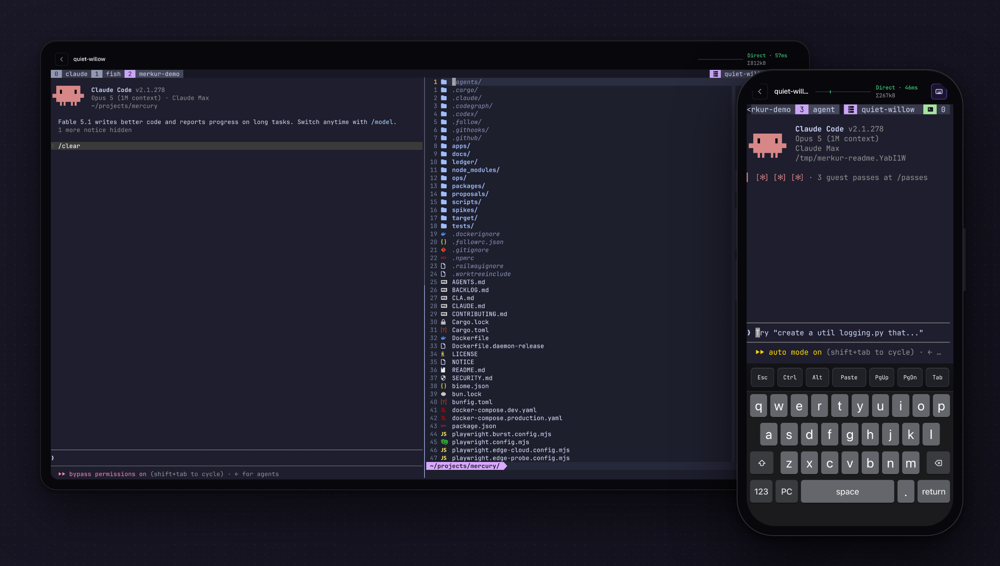
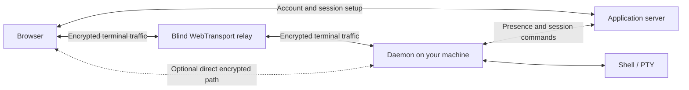

# Merkur

**Merkur is a terminal for your remote machines that runs in the browser.** Link a
workstation, a server, or a hosted box once, then open it from any laptop or phone and work in
Neovim, tmux, or Claude Code the way you would at the desk. Typing is echoed locally, the screen
stays correct on a bad connection, and glyphs render like a native terminal's. Setup is one
command on the machine and one approval from a device you already trust.

**Merkur is in beta.** During the beta, the hosted service at [app.merkur.sh](https://app.merkur.sh) is
free for linking your own machines, relay included. Hosted boxes are not part of the free beta.

[Try Merkur](https://app.merkur.sh) · [Website](https://merkur.sh) · [Quickstart](#quickstart) ·
[How it works](#how-it-works) · [Comparison](#comparison) · [Documentation](#documentation)

[](https://github.com/merkur-sh/merkur/actions/workflows/ci.yml)
[](https://github.com/merkur-sh/merkur/releases/latest)
[](LICENSE)

<a href="docs/assets/cover.png"></a>

Claude Code and Neovim in tmux on a hosted Linux box, from a desktop browser and from a phone.

Created and maintained by [@ph1losof](https://github.com/ph1losof).

## In short

- **It feels local.** Merkur is engineered performance first, from a Rust daemon that owns the
  screen to a WebGPU renderer that runs off the browser's UI thread, so it stands next to a native
  client rather than a web page. Keystrokes are painted before the round trip completes, and the
  shell tells the browser exactly when that is safe, so Neovim and agent prompts never get a
  guessed character.
- **A lost packet costs one extra round trip at most.** Not a stalled screen as over SSH, and not
  a retransmit timer as with Mosh. Measured side by side under loss, the median matches Mosh and
  the tail is much shorter; the [performance guide](docs/performance.md#against-mosh) has the
  numbers.
- **A Wi-Fi to cellular handoff keeps the session.** The daemon holds it through the gap and the
  browser rejoins; nothing to reattach.
- **Nothing to install on the device, nothing to open on the host.** A browser and a password on
  any laptop or phone, including a borrowed one, with no SSH keys to carry. The daemon dials out,
  so there is no inbound SSH, no Tailscale on both ends, and no UDP port range.
- **The whole machine, not one agent's chat.** Neovim, tmux, and every agent you run, with inline
  images, clickable links, crisp Nerd Font glyphs, and a touch keyboard.
- **Nothing in the middle can read it.** Every session is keyed end to end between the browser
  and the daemon with a post-quantum ML-KEM handshake and Noise, so the relay and the application
  server never hold a terminal key. Your password never leaves the browser (OPAQUE), each
  machine's identity lives in its Secure Enclave or TPM, every browser is a delegation you can
  revoke from Settings, and daemon updates are signed with rollback protection.

## Quickstart

You need a Mac or Linux machine to reach and a [supported browser](#requirements).

1. **[Open Merkur](https://app.merkur.sh)**, create an account (free during the beta), and choose
   **Add a machine**.
2. **Paste the command it shows** into a shell on that machine. It installs the daemon as a user
   service and prints an approval link and a QR code.

   ```sh
   curl -fsSL https://app.merkur.sh/install | MERKUR_LINK_TOKEN=<token> sh
   ```

3. **Approve it** by opening the link, or scanning the code with a signed-in phone, and entering
   your password. The machine appears in your device list. Open it.
4. **Turn on local echo** by adding the [shell integration](docs/daemon.md#shell-integration) to
   the end of your shell's startup file on that machine. It is the largest felt-latency win Merkur
   has; without it every keystroke waits for a full network round trip.

   ```sh
   eval "$(merkur shell-integration bash)"   # ~/.bashrc
   eval "$(merkur shell-integration zsh)"    # ~/.zshrc
   merkur shell-integration fish | source    # ~/.config/fish/config.fish
   ```

Would rather not link your own hardware? Open **New box** in the app to join the hosted-box
waitlist. A box is a Linux machine with the daemon and shell integration already installed.

<details>
<summary>Verify the installation key</summary>

The first install trusts HTTPS to the server and GitHub for the binary and its embedded release
key. Later updates verify signed manifests against that pinned key. Compare the fingerprint
printed by the installer, or by `merkur release-key`, with:

```text
733e336c becc7559 82591288 a138b3e3 6f74e40e ac916431 cf355b10 c234f059
```

If it differs, do not link the machine. See the [security policy](SECURITY.md#release-key).

</details>

## In detail

The mechanism behind each claim above, in the same order.

- **Local echo, gated by the shell.** The browser paints a typed character at once and corrects it
  only if the shell disagrees. The shell integration, not a heuristic, decides when prediction
  applies: it emits authenticated prompt boundaries, so the daemon knows when a line editor owns
  the input and turns echo off everywhere else, including Neovim's normal mode and an agent's
  prompt. It is Mosh's idea with the shell deciding.
- **Loss costs rows, not the screen.** SSH runs over TCP, so one lost packet holds back everything
  behind it. Merkur's display updates are QUIC datagrams, each a complete change to the screen, so
  losing one costs the rows it carried and nothing more. A lost echo is replayed on the path that
  lost it, and bursts of output carry forward error correction, so a drop costs at most one extra
  round trip.
- **The session outlives the connection.** Switch from Wi-Fi to cellular, lock the phone, or lose
  the link for a moment. The daemon holds the session through the gap and the browser rejoins it,
  or opens a fresh one with a full snapshot when the gap is too long.
- **No SSH keys, ports, or client.** You sign in with a password, and each browser you sign in
  from holds its own 30-day delegation. Each machine is approved once from a device you already
  trust; nothing to copy into `~/.ssh`, no config aliases, no agent forwarding. The daemon dials
  out over HTTPS and QUIC, and a direct path, when one is possible, is punched through your NAT
  from the inside, so there is no port to forward and no firewall rule to add. The web app installs
  as a PWA. Sign in on a friend's laptop or phone, then revoke that browser from Settings when you
  leave; your own devices keep their sessions.
- **Glyphs like a native terminal's.** A Rust terminal emulator in the daemon owns the screen and
  ships cell changes, not pixels or HTML. In the browser a WebAssembly build of the same emulator
  feeds a WebGPU renderer in a worker. Glyphs rasterize at the device's pixel density and snap to
  whole pixels from a bundled JetBrains Mono Nerd Font, so icons, box drawing, and powerline
  segments are crisp. `nvim`, `starship`, and `lazygit` look the way they do on your desktop.
- **Images and links land in the browser.** Kitty graphics render inline. Links are clickable, and
  `merkur open` sends a URL from the remote shell to the browser you are using, which is what makes
  `gh auth login` work on a machine you are not sitting at.
- **A phone gets terminal keys.** The installed PWA ships a touch keyboard with Esc, Ctrl, Alt,
  Tab, arrows, paging, and paste. Answer an agent's prompt from the sofa, then sit back down at the
  desk and the session is where you left it.

## Who it's for

| Your workflow | What Merkur gives you |
| --- | --- |
| **Running coding agents** on a workstation, server, or box | Read progress, answer prompts, and approve plans from any device. When a change needs your hands, open Neovim next to the agent and it works like it does at the desk. |
| **Editing and building** with Neovim, tmux, and command-line tools | Your existing development environment from a desktop, tablet, or phone, with nothing to reinstall. |
| **Operating servers and homelabs** | A terminal for logs, processes, and one-off commands on every machine you have linked, from one device list. |

## How it works



The application server handles accounts, device linking, and session authorization. **It never
carries terminal input or display updates.** A session starts through a relay that only ever sees
ciphertext, and when the browser and the daemon can reach each other it upgrades to a direct
WebTransport connection and the relay drops out.

The Rust daemon keeps the authoritative terminal grid and sends display changes to the browser as
self-contained QUIC datagrams, with replay and forward error correction on lossy paths. Browser
workers own transport, decoding, and WebGPU rendering, so the UI thread only handles input. The
[transport design](docs/transport.md), [display invariants](docs/display-invariants.md), and
[performance methodology](docs/performance.md) cover the implementation and its tradeoffs.

## Comparison

The three setups most people use for this today, against Merkur. The clients named are the
usual ones: [Termius](https://termius.com/) and [Blink Shell](https://blink.sh/) for SSH and
[Mosh](https://mosh.org/), and the Claude app for
[Claude Code Remote Control](https://docs.claude.com/en/docs/claude-code/remote-control).

| | Merkur | Tailscale + SSH + tmux | Mosh + tmux | Claude Code Remote Control |
| --- | --- | --- | --- | --- |
| Runs in a browser, nothing to install | Yes | No | No | Yes |
| Works from a borrowed device without your keys | Yes | No | No | Yes |
| Survives a Wi-Fi to cellular handoff | Yes | No, you reattach tmux | Yes | Yes |
| Typing painted before the round trip | Yes, gated by the shell | No | Yes, guessed | No |
| Behavior under packet loss | One extra round trip at most | Stalls on every loss | Waits on a retransmit timer | Not a terminal |
| Full terminal: Neovim, tmux, any agent | Yes | Yes | Yes | No, one Claude Code chat |
| Inline images | Yes, Kitty graphics | Depends on the client | No | No |
| Host needs only outbound connections | Yes | No, inbound SSH or Tailscale on both ends | No, mosh-server and a UDP port range | Yes |
| Terminal bytes readable by a middlebox | No, keyed end to end | No, there is none | No, there is none | Yes, the vendor's service |

[herdr](https://herdr.dev/) and tmux are not alternatives but what you run inside Merkur.
[code-server](https://coder.com/docs/code-server) and
[GitHub Codespaces](https://docs.github.com/en/codespaces/about-codespaces/what-are-codespaces)
are for a graphical IDE rather than a terminal.

## Requirements

| Where   | What you need                                                                                                                                                                                                           |
| ------- | ----------------------------------------------------------------------------------------------------------------------------------------------------------------------------------------------------------------------- |
| Browser | WebGPU, WebTransport with certificate-hash pinning, WebAssembly SIMD, and cross-origin-isolated SharedArrayBuffer support. GPU and driver support matter; see the [browser requirements](docs/requirements.md#browser). |
| Mac     | macOS 13 or newer, Apple Silicon or Intel with AVX2.                                                                                                                                                                    |
| Linux   | glibc 2.36 or newer, kernel 5.1 or newer, a systemd user session, and arm64 or x86-64 with AVX2.                                                                                                                        |
| Network | Outbound HTTPS/WSS and UDP for QUIC.                                                                                                                                                                                    |

Hardware identity uses Secure Enclave or TPM 2.0 where available; software custody requires
explicit opt-in. The [full requirements](docs/requirements.md) list browser versions, hardware
identity prerequisites, and platform checks.

## Security model

Merkur uses OPAQUE for password authentication, explicitly approved daemon identities, and
revocable browser delegations. Terminal sessions combine a fresh ML-KEM-1024 bootstrap with
Noise encryption; daemon releases use signed manifests and rollback protection.

The encryption protects terminal contents on the relay and direct paths. It does **not** hide
traffic timing or sizes, protect a compromised endpoint, or remove trust in the JavaScript served
by the application origin. Account and management traffic still rely on TLS. Read the
[complete threat model](docs/security.md) for the scope of the post-quantum design and its limits.

Report vulnerabilities privately through the [security policy](SECURITY.md).

## Development

Use the Bun version in [`package.json`](package.json), the pinned
[Rust toolchain](rust-toolchain.toml), Docker with Compose, `wasm-pack`, and LLVM
(Homebrew `llvm` on macOS).
Run these commands from the repository root:

```sh
bun install
bun run infra:up  # Start local Redis
bun run setup    # Configure local env, hooks, and Rust/WASM artifacts
bun run dev      # Start the edge, server, and browser app
```

Open the local URL printed by the development server. Link a local daemon to use a terminal;
`bun run dev:full` also runs that daemon once it is linked. `bun run dev:doctor` diagnoses missing
services, tools, and artifacts.

See the [development guide](docs/development.md) for daemon development, build commands, tests,
and deployment prerequisites. [CONTRIBUTING.md](CONTRIBUTING.md) covers contributions and the CLA.

Pull requests and pushes to `main` run [CI](.github/workflows/ci.yml). Version tags trigger the
[release workflow](.github/workflows/release.yml): building, signing, service deployment, and
publication. See [CI operations](docs/ci.md) and [releases](docs/releases.md).

## Documentation

| Start here | Read more |
| --- | --- |
| Using Merkur | [Requirements](docs/requirements.md) · [Daemon commands and shell integration](docs/daemon.md) · [Native image submission](docs/native-images.md) |
| Building and contributing | [Development](docs/development.md) · [Contributing](CONTRIBUTING.md) |
| Understanding the design | [Architecture](docs/architecture.md) · [Processes](docs/processes.md) · [Transport](docs/transport.md) · [Display](docs/display-invariants.md) · [Graphics](docs/graphics.md) · [Performance](docs/performance.md) |
| Operating a deployment | [Configuration](#configuration) · [Observability](docs/observability.md) · [CI](docs/ci.md) · [Releases](docs/releases.md) |
| Evaluating security | [Threat model](docs/security.md) · [Reporting vulnerabilities](SECURITY.md) |

## License

Merkur is licensed under the [GNU AGPL v3.0](LICENSE). One component has separate terms: the
shared logger, [`packages/logger`](packages/logger), uses Apache 2.0.

See [NOTICE](NOTICE) for details and run `merkur licenses` for bundled dependency notices and the
corresponding-source offer. Contributions require the [Contributor License Agreement](CLA.md).

Rights beyond the public licenses, such as proprietary modification, OEM use, or a hosted
service, are available under a separate agreement; see [commercial licensing](COMMERCIAL-LICENSING.md).
The licenses do not cover the Merkur name or logo; see the [trademark policy](TRADEMARK.md).

## Workspace Layout

Bun and TypeScript handle the application and orchestration; Rust owns the terminal data path.

<details>
<summary>Applications, packages, and maintained harnesses</summary>

| Path                                | Role                                                                         |
| ----------------------------------- | ---------------------------------------------------------------------------- |
| `apps/web`                          | Browser app: SolidJS, workers, WebGPU, and WASM.                             |
| `apps/server`                       | Accounts, device linking, presence, session issuance, and web serving.       |
| `apps/edge`                         | Blind WebTransport relay.                                                    |
| `apps/daemon`                       | Local CLI, service lifecycle, signed updates, and server control connection. |
| `apps/daemon/dataplane`             | Rust PTY, authentication, transport, input, and display synchronization.     |
| `apps/stun`                         | Authenticated STUN observations and direct-path verification.                |
| `apps/site`                         | Website: static pages, their build checks, and the static server.            |
| `apps/tui`                          | Native terminal client (`merkur-tui`): interactive and headless sessions.        |
| `packages/auth`                     | OPAQUE account authentication, tokens, and session authorization.            |
| `packages/config`                   | Server and daemon configuration.                                             |
| `packages/logger`                   | Structured logging and Effect integration.                                   |
| `packages/protocol`                 | Binary terminal protocol.                                                    |
| `packages/shared`                   | Shared contracts, crypto helpers, transport utilities, and IPC framing.      |
| `packages/daemon-control-protocol`  | Server–daemon control messages.                                              |
| `packages/keyboard`                 | Configurable touch terminal keyboard.                                        |
| `packages/quicksilver`              | Quicksilver design system: tokens, UnoCSS preset, UI faces, Vite plugins.    |
| `packages/user-agent`               | Bounded browser and OS identification.                                       |
| `packages/term-wasm`                | Browser terminal state, display decoding, fonts, and rendering data.         |
| `packages/term-wasm-pgo`            | Training driver for the profile-guided `term-wasm` build; nothing ships it.  |
| `packages/merkur-authorization`     | Delegations, daemon bindings, revocations, link approval, root envelope.     |
| `packages/merkur-client`            | Sans-IO client core: issuance, authentication, lanes, input.                 |
| `packages/merkur-identity-seal`     | Native identity custody: Secure Enclave, TPM, explicit software storage.     |
| `packages/merkur-client-native`     | Native driver for the client core: account API, WebTransport, tokio.         |
| `packages/merkur-codec`             | Shared display codec.                                                        |
| `packages/merkur-e2e`               | Native and browser session bootstrap, Noise, and replay protection.          |
| `packages/merkur-edge-protocol`     | Edge routing preface and splice-control events.                              |
| `packages/merkur-stun-protocol`     | Shared authenticated STUN codec.                                             |
| `packages/merkur-wire`              | Client–dataplane wire: channels, frames, input records, signaling.           |
| `packages/e2e-wasm`                 | Browser bindings for session encryption.                                     |
| `packages/graphics-wasm`            | Browser graphics verification.                                               |
| `packages/graphics-codec-probe`     | Benchmark-only graphics decoder.                                             |
| `packages/merkur-fec`               | Display forward error correction.                                            |
| `packages/merkur-graphics`          | Kitty graphics ingestion, placement, and resource ownership.                 |
| `packages/merkur-image-worker`      | Isolated image decoding and tile encoding.                                   |
| `packages/zstd-fixture`             | Native fixtures for browser compression benchmarks.                          |
| `packages/alacritty-terminal-patch` | Patched authoritative terminal grid.                                         |
| `packages/vte-patch`                | Patched terminal escape-sequence parser.                                     |
| `packages/wtransport-patch`         | Patched WebTransport implementation.                                         |
| `packages/quinn-patch`              | Patched asynchronous QUIC transport.                                         |
| `packages/quinn-proto-patch`        | Patched QUIC protocol and congestion accounting.                             |
| `packages/fontdue-patch`            | Patched font rasterizer.                                                     |
| `spikes/webtransport-ios`           | Real-device WebTransport acceptance harness.                                 |

</details>

## Configuration

For local development, `bun run setup` creates the server environment. For deployments, start
with [`apps/server/.env.example`](apps/server/.env.example) and the
[deployment guide](docs/development.md#infrastructure-and-deployment).

<details>
<summary>Server environment variables</summary>

Loaded by `packages/config/src/server-config.ts`.

<!-- generated:server-environment -->
| Variable | Required | Notes |
| --- | --- | --- |
| `HOST` | No | HTTP server bind address. Default: `0.0.0.0`. |
| `PORT` | No | HTTP server listen port. Default: `3000`. |
| `PUBLIC_ORIGIN` | No | Canonical origin browsers reach Merkur at. Set explicitly for deployments. Local setup uses http://127.0.0.1:3000. It is checked against signed browser delegations and used as the daemon linking target. Default: `https://localhost:3000`. |
| `DB_URL` | No | Defaults to `file:./data/merkur.db`. `file:` opens a local database in-process; `http(s)://` or `libsql://` reach a libSQL server, which is what production runs so more than one process can share one database. The compiled server carries only the network client, so a `file:` URL is refused there. Default: `file:./data/merkur.db`. |
| `DB_AUTH_TOKEN` | No | Bearer credential for a remote database; unset for a local one. |
| `REDIS_URL` | Yes | Redis or Dragonfly URL. Railway Dragonfly can be mapped from `DRAGONFLY_PRIVATE_URL`. |
| `ACCESS_TOKEN_HMAC_KEY` | Yes | Canonical unpadded base64url for exactly 64 random bytes. It authenticates the single fixed access-token format; there is no key id or algorithm negotiation. |
| `JWT_ISSUER` | No | Access-token issuer. Default: `merkur`. |
| `JWT_AUDIENCE` | No | Access-token audience. Default: `merkur-clients`. |
| `TOKEN_HMAC_SECRET` | Yes | Canonical unpadded base64url for exactly 64 random bytes; domain-separated HMAC-SHA-512 hashes refresh and link tokens, and derives deterministic synthetic absent-account auth-start material. Rotation changes future provisional values; already-created Redis auth flows retain their recorded material until consumed or expired. |
| `AUTH_ALLOW_REGISTRATION` | Yes | Explicit account-creation policy. The combined OPAQUE start remains available in either state. When `false`, every registration finish answers `403 registration_closed`, whether the username is new or belongs to an account whose password was mistyped, so the refusal does not enumerate usernames; existing-account login is unchanged. When `true`, account creation is limited to five per source address per hour. |
| `AUTH_IDENTITY` | Yes | What accounts are named by: `username` or `email`. Username mode accepts any 3-254 character name and sends no mail; use it for self-hosting. Email mode accepts only an address and creates an account only after a six-digit code mailed to it is entered; an address that already has an account is mailed a notice instead of a code, so sign-up still does not enumerate accounts. |
| `RESEND_API_KEY` | With `AUTH_IDENTITY=email` | Resend API key that sends sign-up and password-reset codes. Refused in username mode. |
| `EMAIL_FROM` | With `AUTH_IDENTITY=email` | Sender header, e.g. `Merkur <signin@merkur.sh>`; its domain must be verified in Resend. Refused in username mode. |
| `RESEND_API_URL` | No | Resend API base URL; defaults to `https://api.resend.com`. Only valid in email mode. |
| `SITE_ORIGIN` | No | Origin of the public website. Set it to take Boxes waitlist addresses from that site: the waitlist route exists only when it is set, accepts a post from this origin alone, and names only it in `Access-Control-Allow-Origin`. |
| `RYBBIT_HOST` | With `RYBBIT_SITE_ID` and `RYBBIT_API_KEY` | Rybbit origin the server reports a new waitlist address to; `/api/track` is appended. The three Rybbit variables are set together or not at all, and need `SITE_ORIGIN`. |
| `RYBBIT_SITE_ID` | With `RYBBIT_HOST` and `RYBBIT_API_KEY` | Rybbit site the website reports to, so both kinds of event land on one site. |
| `RYBBIT_API_KEY` | With `RYBBIT_HOST` and `RYBBIT_SITE_ID` | Rybbit API key, sent as `Authorization: Bearer`. It marks the event as ingestion from this server and never reaches the website. |
| `OPAQUE_SERVER_SETUP` | Yes | Stable canonical OPAQUE server setup. Replacing it invalidates every OPAQUE registration record. Keep it secret and durable. |
| `OPAQUE_SERVER_PUBLIC_KEY` | Yes | Canonical public key derived from `OPAQUE_SERVER_SETUP`; startup fails if they do not match. |
| `VITE_MERKUR_OPAQUE_SERVER_PUBLIC_KEY` | Build + standalone startup | Must equal `OPAQUE_SERVER_PUBLIC_KEY`. The browser pins this value; Docker validates it as a build argument and compiles it into the server for a pre-migration startup comparison. |
| `TRUSTED_PROXY_HOPS` | Yes | Number of reverse proxies in front of the server that append to `X-Forwarded-For`. `0` ignores the header and keys rate limits on the socket address; use `1` behind a single proxy such as Railway or Fly. Wrong values either let a client forge its own rate-limit key or collapse every client into one bucket, so there is no default. |
| `SESSION_TOKEN_MLDSA87_SEED` | Yes | Canonical unpadded base64url for exactly 32 random bytes used to derive the fixed ML-DSA-87 session-authorization keypair. Existing daemons must relink after an intentional hard-cut key replacement. |
| `SESSION_TOKEN_TTL_MS` | No | Session-capability lifetime from 2000 through 300000 milliseconds. Reconnects request fresh capabilities. Server and daemon clocks must be synchronized. Default: `60000`. |
| `BOX_HOST_URL` | No | Canonical HTTP(S) origin of the box host. Configure together with `BOX_HOST_TOKEN`; both absent disables hosted-box provisioning. Credentials, paths, queries, fragments, and trailing slashes are refused. |
| `BOX_HOST_TOKEN` | With `BOX_HOST_URL` | Bearer token the box host authorizes with. |
| `BOX_HOST_TIMEOUT_MS` | No | Positive integer request timeout in milliseconds, no greater than 2147483647. Default: `120000`. |
| `EDGE_REGISTRATION_KEYS_JSON` | Yes | Canonical minified JSON mapping each edge id to its distinct canonical base64url 64-byte HMAC-SHA-512 key. The server refuses to boot on an empty, reused, malformed, or noncanonical map. |
| `EDGE_ATTACH_TICKET_KEY` | Yes | Canonical unpadded base64url for exactly 64 random bytes. The deployment secret every edge verifies attach tickets with: the server mints one per daemon on each control lease and one per browser session, and an edge closes any peer without a valid ticket. Set the same value as `MERKUR_EDGE_ATTACH_TICKET_KEY` on every edge. |
| `STUN_TICKET_KEY` | Yes | Canonical unpadded base64url for exactly 64 random bytes. The deployment secret every `merkur-stun` responder derives per-ticket MESSAGE-INTEGRITY-SHA256 keys from; the server mints short-lived tickets over the daemon control connection and the daemon never sees this value. Set the same value as `MERKUR_STUN_TICKET_KEY` on the responder. |
| `STUN_SERVERS` | Yes | At least two distinct comma-separated `host:port` vantage points, with ports from 1 through 65535. Use independent addresses in production; two ports of one address establish only port dependence. Local development uses blackholed TEST-NET-1 addresses. |
| `BOX_HOST_STUN_OBSERVERS` | No | The `STUN_SERVERS` entries that run on the box host, spelled exactly as there. Left out of a box daemon's list, because a box reaches its own host without crossing its NAT and would classify it from a private address. Empty by default. |
| `WEB_PUSH_VAPID_PUBLIC_KEY` | Optional group | Canonical unpadded base64url P-256 public key. Configure together with `WEB_PUSH_VAPID_PRIVATE_KEY` and `WEB_PUSH_CONTACT`; partial or mismatched groups fail startup. |
| `WEB_PUSH_VAPID_PRIVATE_KEY` | Optional group | Canonical unpadded base64url P-256 private key matching the public key. Configure the complete web-push group. |
| `WEB_PUSH_CONTACT` | Optional group | Web-push contact: a `mailto:` address or an HTTPS URL. Required with the VAPID keypair. |
| `AXIOM_TOKEN` | Optional group | Axiom API token. Supplying it enables OTLP export of traces, Effect-native logs, and metrics; supply all four Axiom variables or none. Unset, spans are printed to stdout as a tree instead of exported. |
| `AXIOM_DATASET` | Optional group | Dataset receiving traces and logs (`x-axiom-dataset`). |
| `AXIOM_METRICS_DATASET` | Optional group | Dataset receiving metrics (`x-axiom-metrics-dataset`). Separate from traces and logs because Axiom's metrics intake uses a different header and accepts only protobuf. |
| `AXIOM_PERF_DATASET` | Optional group | Dataset receiving browser profiling rows, written through Axiom's native `/v1/ingest/{dataset}` API rather than OTLP. Without it, profiling batches are accepted and discarded as unconfigured. On the free tier this is the third and last dataset allowed. |
| `AXIOM_ENDPOINT` | No | Axiom intake base URL without credentials, query, or fragment. Datasets outside the default region require their own edge deployment URL, which is not api.<region>.axiom.co; read edgeDeploymentUrl from the dataset API. Default: `https://api.axiom.co`. |
| `TELEMETRY_ENVIRONMENT` | No | Value of the deployment.environment.name resource attribute. Set to production on the deployed server. Default: `development`. |
| `TRACE_LEVEL` | No | Minimum sampled span level: All, Fatal, Error, Warn, Info, Debug, Trace, or None. Applies equally to stdout and OTLP export; Debug enables Redis operation and health-poll spans. Default: `Info`. |
| `TRACE_SAMPLE_RATIO` | No | Share of unremarkable traces retained, from 0 to 1. Failures, slow traces, and traces reaching a daemon are always retained. Default: `1`. |
| `TRACE_SLOW_THRESHOLD_MS` | No | Root-span duration in milliseconds at or above which a trace is always retained. Default: `1000`. |
| `LOG_LEVEL` | No | Shared JSON-log threshold: info, warn, error, or silent. Unset or unrecognized values emit all supported levels. |
<!-- /generated:server-environment -->

Edge replicas are configured through `MERKUR_EDGE_*` variables documented in
[`apps/edge/README.md`](apps/edge/README.md); each replica's registration key is the exact per-id
entry from `EDGE_REGISTRATION_KEYS_JSON` and is never sent, and every replica verifies attach tickets
with the one deployment-wide `EDGE_ATTACH_TICKET_KEY`. STUN responders are configured through
`MERKUR_STUN_*` variables documented in [`apps/stun/README.md`](apps/stun/README.md), including the
two-address topology that independent WebTransport verification needs; a rejected ticket is
answered with silence, so the two ticket implementations are pinned to one vector by both test
suites. The daemon's `~/.merkur/config.json` schema, hardware identity custody (Secure Enclave on
macOS, TPM 2.0 on Linux, or `--identity-backend software`), and the hard-cut migration policy are in
[`docs/security.md`](docs/security.md#sensitive-local-state-and-hard-cutover).

</details>
